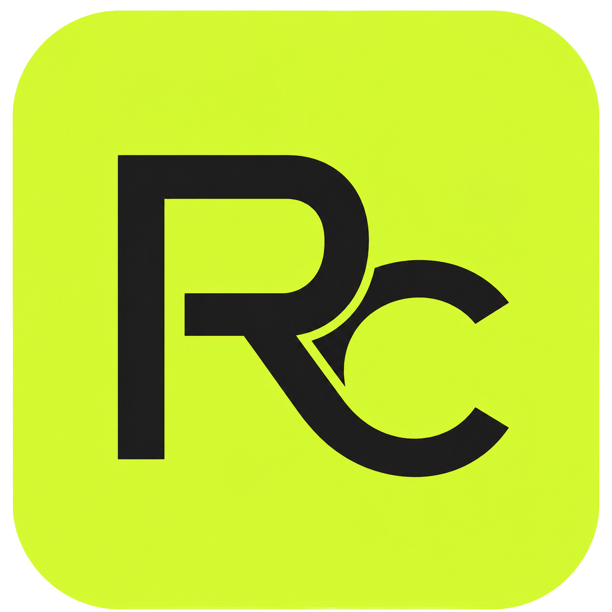
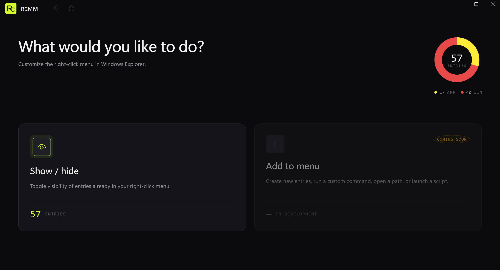
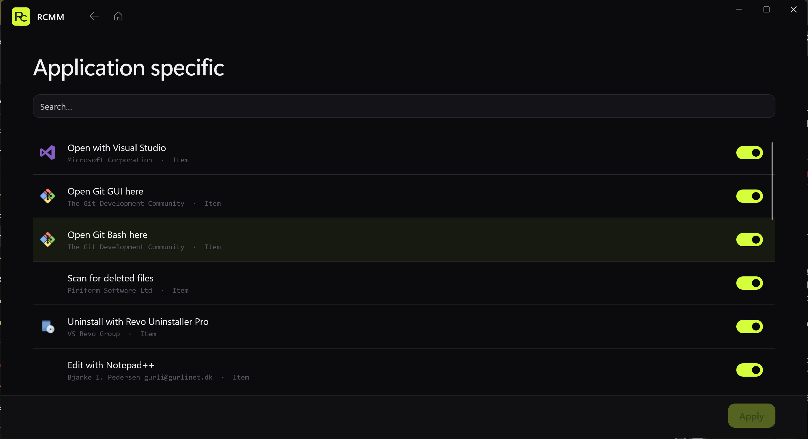

<div align="center">
  

  # RCMM

  Right-Click Menu Manager. Show or hide entries in the Windows Explorer right-click menu. More coming soon.

  [](https://github.com/Maxaubert/RCMM/releases)
  [](https://github.com/Maxaubert/RCMM/releases/latest)
</div>

---

<div align="center">
  
  <br><br>
  
  <br><br>
  
</div>

## Install

Grab the latest installer from the [Releases page](https://github.com/Maxaubert/RCMM/releases/latest):

- `RCMM-Setup-x64-<version>.exe` — self-contained, no .NET runtime or Windows App SDK needed. Windows 10 1809+ / Windows 11, x64.

The installer is unsigned, so SmartScreen will warn the first time — click *More info* → *Run anyway*.

## Build from source

Requirements:

- Windows 10 or 11
- [.NET 8 SDK](https://dotnet.microsoft.com/download/dotnet/8.0)
- Windows App SDK (restored automatically from NuGet on build)

```powershell
git clone https://github.com/Maxaubert/RCMM.git
cd RCMM
dotnet build manager\src\RCMM\RCMM.csproj
```

Output: `manager\src\RCMM\bin\Debug\net8.0-windows10.0.19041.0\RCMM.exe`.

To rebuild the installer (requires [Inno Setup 6](https://jrsoftware.org/isdl.php)):

```powershell
dotnet publish manager\src\RCMM\RCMM.csproj -c Release -r win-x64 --self-contained true `
  -p:Platform=x64 -p:WindowsAppSDKSelfContained=true -p:WindowsPackageType=None `
  -o dist\publish
& "${env:ProgramFiles(x86)}\Inno Setup 6\ISCC.exe" installer\RCMM.iss
```

## License

MIT (see [LICENSE](LICENSE) once added).
